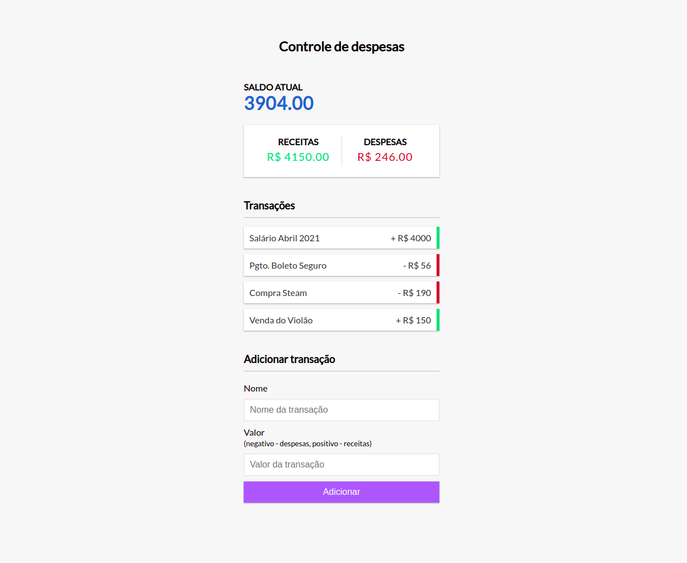

## Controle Financeiro com Javascript

   

> Esse código foi desenvolvido durante a aula de aplicação Javascript Puro com o Roger Melo

Controle financeiro com o layout montado em HTML e CSS e controlado totalmente por Javascript.
Deploy da aplicação:

    https://isaacwrk.github.io
    
Para testes no seu ambiente local execute um git clone neste repositório

    git clone https://github.com/isaacwrk/ControledeGastos.JS.git

E depois abra o arquivo

    index.html

